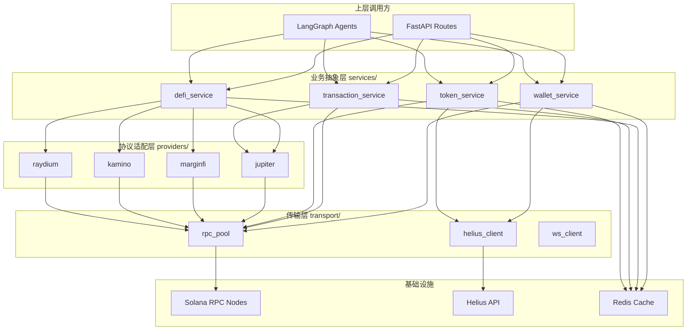

# Solon AI — Solana RPC 模块开发指南


---

## 目录

1. [模块定位与职责边界](#1-模块定位与职责边界)
2. [技术选型建议](#2-技术选型建议)
3. [分层架构设计](#3-分层架构设计)
4. [核心接口设计](#4-核心接口设计)
5. [DeFi 协议对接指南](#5-defi-协议对接指南)
6. [错误处理与容灾策略](#6-错误处理与容灾策略)
7. [缓存与性能优化](#7-缓存与性能优化)
8. [安全注意事项](#8-安全注意事项)
9. [与其他模块的协作接口](#9-与其他模块的协作接口)
10. [版本迭代路线](#10-版本迭代路线)
11. [开发环境与测试策略](#11-开发环境与测试策略)
12. [附录：关键参考资料](#12-附录关键参考资料)

---

## 1. 模块定位与职责边界

### 1.1 在系统中的位置

```
AI 智能体层 (LangGraph Agents)
      │
      ├── 链上数据聚合 Agent ──→ 调用 RPC 模块获取链上数据
      ├── 风控审计 Agent ──────→ 调用 RPC 模块检测合约安全
      └── 非托管执行 Agent ────→ 调用 RPC 模块构建/发送交易
      │
后端业务层 (FastAPI Services)
      │
      ├── AssetService ────────→ 调用 RPC 模块查询资产
      └── StrategyService ─────→ 调用 RPC 模块执行策略
      │
 ─────▼─────────────────────────────────────
│   Solana RPC 模块 (你的核心职责)         │
│   ┌─────────────────────────────────┐   │
│   │  统一抽象层 (Blockchain Service) │   │
│   │  ┌───────┐ ┌───────┐ ┌───────┐ │   │
│   │  │ Helius│ │Alchemy│ │Solana │ │   │
│   │  │  RPC  │ │  RPC  │ │ FM    │ │   │
│   │  └───────┘ └───────┘ └───────┘ │   │
│   └──────────────┬──────────────────┘   │
│   ┌──────────────▼──────────────────┐   │
│   │  DeFi 协议适配层                 │   │
│   │  Jupiter │ MarginFi │ Kamino    │   │
│   │  Raydium │ Drift    │ Jito      │   │
│   └─────────────────────────────────┘   │
 ──────────────────────────────────────────
      │
      ▼
  Solana 区块链 (Mainnet / Devnet)
```

### 1.2 核心职责

| 职责领域 | 具体内容 |
|:---|:---|
| **链上数据查询** | 钱包余额、SPL 代币账户、NFT 持仓、交易历史、授权记录 |
| **DeFi 协议数据聚合** | 实时 APY、TVL、池子信息、用户仓位（MarginFi/Kamino/Raydium 等） |
| **交易构建** | 构建标准 Solana 交易指令（Transfer/Swap/Deposit/Withdraw） |
| **交易发送与监听** | 发送已签名交易、轮询/WebSocket 监听交易状态 |
| **RPC 连接管理** | 多 RPC 端点负载均衡、故障切换、限流管理 |
| **数据标准化** | 将链上原始数据转换为上层服务可直接消费的标准化数据格式 |

### 1.3 职责边界（不负责的部分）

> [!IMPORTANT]
> 以下工作由其他模块负责，RPC 模块**不应**包含这些逻辑：

- ❌ 用户认证/鉴权 → Auth Service 负责
- ❌ 策略生成/AI 决策 → LangGraph Agents 负责
- ❌ 风险评级/黑名单维护 → 风控 Agent 负责（但 RPC 模块需提供合约信息查询的基础能力）
- ❌ 钱包签名 → 前端 Wallet Adapter 负责（用户自行签名）
- ❌ 数据持久化 → 数据库层负责（但 RPC 模块管理自己的 Redis 缓存）

---

## 2. 技术选型建议

### 2.1 RPC Provider 对比与选型

| 特性 | Helius (推荐主力) | Alchemy | QuickNode | 原生 Solana RPC |
|:---|:---|:---|:---|:---|
| **免费额度** | 100K credits/天 | 300M CU/月 | 有限 | 公共节点不限（但不稳定） |
| **DAS API（NFT/压缩NFT）** | ✅ 原生支持 | ✅ 支持 | ❌ | ❌ |
| **Enhanced Transactions** | ✅（交易解析） | ❌ | ❌ | ❌ |
| **WebSocket** | ✅ | ✅ | ✅ | ✅ |
| **Webhook** | ✅ | ✅ | ❌ | ❌ |
| **Token Metadata** | ✅（内置） | 需额外调用 | 需额外调用 | ❌ |
| **延迟 (亚太)** | ~150ms | ~120ms | ~100ms | 不稳定 |
| **价格** | 免费额度充足 | 免费额度充足 | 偏贵 | 免费 |

> [!TIP]
> **推荐方案**：以 Helius 作为主力 RPC（Enhanced API 和 DAS API 对产品非常有价值），Alchemy 作为备用。公共 Solana RPC 仅用于开发测试。

### 2.2 核心依赖库

```
# Python 端 (后端 / AI 服务层使用)
solana-py (solana)        >= 0.34.0   # Solana Python SDK
solders                   >= 0.21.0   # 高性能 Solana 数据结构
anchorpy                  >= 0.20.0   # Anchor 协议交互（MarginFi/Kamino 等）
httpx                     >= 0.27.0   # 异步 HTTP 客户端（调用 Helius/Jupiter REST API）
websockets                >= 12.0     # WebSocket 连接
base58                    >= 2.1.0    # Base58 编解码
construct-typing          >= 0.6.0    # 结构化数据解析

# JavaScript/TypeScript 端 (前端构建交易使用)
@solana/web3.js           >= 1.95.0   # Solana JS SDK
@solana/spl-token         >= 0.4.0    # SPL Token 操作
@jup-ag/api               >= 6.0.0    # Jupiter 聚合器 SDK
```

### 2.3 语言选择建议

> [!IMPORTANT]
> 关键决策点：RPC 模块使用 **Python** 还是 **TypeScript**？

**建议采用 Python 实现核心 RPC 模块**，原因如下：

1. 后端 (FastAPI) 和 AI 层 (LangGraph) 都是 Python，同语言可以直接 import 调用，无需跨语言 RPC
2. `solana-py` + `anchorpy` 生态成熟，可以完成所有链上交互
3. 异步性能通过 `asyncio` + `httpx` 可以保证

**但前端交易构建部分需要提供 TypeScript 接口**（用于前端构建待签名交易），建议：
- Python 端：负责数据查询、交易指令生成（序列化为 base64）
- 前端 JS 端：反序列化交易 → 钱包签名 → 回传后端发送

---

## 3. 分层架构设计

### 3.1 推荐分层结构

```
solana_rpc/
├── __init__.py
├── config.py                    # RPC 配置（端点、API Key、超时等）
│
├── transport/                   # 传输层：管理 RPC 连接
│   ├── __init__.py
│   ├── rpc_client.py            # 封装 solana-py RPC 客户端
│   ├── rpc_pool.py              # 多端点连接池 & 负载均衡
│   ├── ws_client.py             # WebSocket 订阅客户端
│   └── helius_client.py         # Helius Enhanced API 客户端
│
├── providers/                   # 协议适配层：各 DeFi 协议的封装
│   ├── __init__.py
│   ├── base.py                  # 协议基类（定义统一接口）
│   ├── jupiter.py               # Jupiter 聚合器（Swap + 路由）
│   ├── marginfi.py              # MarginFi（借贷）
│   ├── kamino.py                # Kamino（借贷 + 流动性）
│   ├── raydium.py               # Raydium（AMM + LP）
│   ├── drift.py                 # Drift（永续合约）— V2.0
│   └── jito.py                  # Jito（质押 + MEV 保护）— V2.0
│
├── services/                    # 业务抽象层：面向上层的高级接口
│   ├── __init__.py
│   ├── wallet_service.py        # 钱包相关：余额、代币、NFT、授权
│   ├── defi_service.py          # DeFi 数据：APY、TVL、用户仓位
│   ├── transaction_service.py   # 交易构建、发送、状态跟踪
│   └── token_service.py        # 代币信息：元数据、价格、安全检测
│
├── models/                      # 数据模型：标准化的输入输出结构
│   ├── __init__.py
│   ├── wallet.py                # WalletBalance, TokenAccount, NFTAsset
│   ├── defi.py                  # ProtocolInfo, PoolInfo, UserPosition
│   ├── transaction.py           # TransactionRequest, TransactionStatus
│   └── token.py                # TokenInfo, TokenPrice, TokenSecurity
│
├── cache/                       # 缓存层
│   ├── __init__.py
│   └── redis_cache.py           # Redis 缓存封装
│
├── utils/                       # 工具函数
│   ├── __init__.py
│   ├── retry.py                 # 重试装饰器
│   ├── rate_limiter.py          # 限流器
│   └── serialization.py         # 序列化/反序列化工具
│
└── exceptions/                  # 自定义异常
    ├── __init__.py
    └── errors.py                # RPCError, ProviderError, TransactionError 等
```

### 3.2 分层职责说明



---

## 4. 核心接口设计

### 4.1 WalletService — 钱包资产查询

```python
# 以下为接口定义示范，实际开发时补充完整实现

class WalletService:
    """钱包资产相关的核心服务"""
    
    async def get_sol_balance(self, address: str) -> SolBalance:
        """
        获取 SOL 余额
        - 返回: lamports + sol 数量 + USD 估值
        - 缓存: 30s TTL
        """
    
    async def get_token_accounts(self, address: str) -> list[TokenAccount]:
        """
        获取所有 SPL 代币持仓
        - 返回: mint 地址、余额、decimals、代币元数据、USD 估值
        - 使用 Helius DAS API 获取元数据（名称、symbol、logo）
        - 缓存: 60s TTL
        """
    
    async def get_nft_assets(self, address: str) -> list[NFTAsset]:
        """
        获取所有 NFT 资产（包括压缩 NFT）
        - 使用 Helius DAS API: getAssetsByOwner
        - 返回: 名称、图片、集合、估值（如果有）
        - 缓存: 300s TTL
        """
    
    async def get_token_approvals(self, address: str) -> list[TokenApproval]:
        """
        获取所有代币授权记录
        - 检查 delegate 字段
        - 标注授权额度、授权时间、授权合约
        - 风控 Agent 会调用此接口检测高危授权
        - 缓存: 120s TTL
        """
    
    async def get_transaction_history(
        self, address: str, limit: int = 50, before: str | None = None
    ) -> list[TransactionRecord]:
        """
        获取交易历史
        - 使用 Helius Enhanced Transactions API 获取解析后的交易
        - 自动分类: Transfer / Swap / DeFi / NFT / Unknown
        - 包含: 时间、类型、涉及代币、金额、交易对手
        - 支持分页 (cursor-based)
        """
    
    async def get_portfolio_summary(self, address: str) -> PortfolioSummary:
        """
        聚合资产全景报告（MVP 核心功能）
        - 整合: SOL + Tokens + NFTs + DeFi 仓位
        - 计算: 总资产 USD 估值、盈亏分析
        - 识别: 闲置资产、高风险持仓
        """
```

### 4.2 DeFiService — DeFi 协议数据

```python
class DeFiService:
    """DeFi 协议数据聚合服务"""
    
    async def get_lending_rates(self) -> list[LendingRate]:
        """
        获取借贷协议利率
        - 聚合 MarginFi, Kamino 等协议的存/借利率
        - 返回: 协议名、代币、存款 APY、借款 APY、TVL
        - 缓存: 120s TTL
        """
    
    async def get_pool_info(self, protocol: str, pool_id: str) -> PoolInfo:
        """
        获取指定流动性池信息
        - 返回: 池子代币对、TVL、24h 交易量、APR/APY、无常损失估算
        """
    
    async def get_user_positions(self, address: str) -> list[UserPosition]:
        """
        获取用户在各 DeFi 协议中的仓位
        - 遍历所有已对接的协议
        - 返回: 协议名、仓位类型、存入金额、当前价值、收益、健康度
        - 核心功能：为"资产全景诊断"提供 DeFi 仓位数据
        """
    
    async def get_best_yields(
        self, token: str, risk_level: str = "conservative"
    ) -> list[YieldOpportunity]:
        """
        获取指定代币的最优收益机会
        - 按风险等级过滤
        - 按 APY 排序
        - 策略生成 Agent 的核心数据源
        """
```

### 4.3 TransactionService — 交易构建与管理

```python
class TransactionService:
    """交易构建、发送与状态跟踪"""
    
    async def build_transfer_tx(
        self, from_addr: str, to_addr: str, 
        token_mint: str | None, amount: float
    ) -> SerializedTransaction:
        """
        构建转账交易
        - SOL 转账 or SPL Token 转账
        - 返回 base64 编码的未签名交易
        """
    
    async def build_swap_tx(
        self, user_addr: str, input_mint: str, output_mint: str, 
        amount: float, slippage_bps: int = 50
    ) -> SerializedTransaction:
        """
        构建 Swap 交易（通过 Jupiter）
        - 获取最优路由
        - 构建交易指令
        - 返回: base64 交易 + 路由详情 + 预期输出 + 价格影响
        """
    
    async def build_defi_tx(
        self, user_addr: str, protocol: str, 
        action: str, params: dict
    ) -> SerializedTransaction:
        """
        构建 DeFi 操作交易
        - action: deposit / withdraw / borrow / repay / add_liquidity / ...
        - 委托给对应 provider 构建具体指令
        """
    
    async def send_transaction(self, signed_tx: str) -> str:
        """
        发送已签名交易到链上
        - 返回: 交易签名 (signature)
        - 使用 skipPreflight=False 确保预执行成功
        - 可选: 通过 Jito 发送（MEV 保护）— V2.0
        """
    
    async def get_transaction_status(self, signature: str) -> TransactionStatus:
        """
        查询交易状态
        - 状态: pending / confirmed / finalized / failed
        - 返回: 确认数、slot、错误信息（如有）
        - 支持轮询和 WebSocket 两种模式
        """
    
    async def estimate_transaction_fee(self, tx: str) -> TransactionFee:
        """
        估算交易费用
        - 包含: base fee + priority fee 建议
        - 根据当前网络拥堵动态调整 priority fee
        """
```

### 4.4 TokenService — 代币信息服务

```python
class TokenService:
    """代币信息与安全检测"""
    
    async def get_token_info(self, mint: str) -> TokenInfo:
        """
        获取代币元数据
        - 名称、symbol、decimals、logo、总供应量
        - 使用 Helius DAS API 或 Token Metadata Program
        - 缓存: 3600s TTL（元数据不常变）
        """
    
    async def get_token_price(self, mint: str) -> TokenPrice:
        """
        获取代币当前价格
        - 优先使用 Jupiter Price API（覆盖面最全）
        - 备选: Birdeye / CoinGecko
        - 返回: USD 价格、24h 变化率
        - 缓存: 30s TTL
        """
    
    async def batch_get_token_prices(self, mints: list[str]) -> dict[str, TokenPrice]:
        """
        批量获取代币价格（性能优化）
        - Jupiter Price API 支持批量查询
        """
    
    async def check_token_security(self, mint: str) -> TokenSecurity:
        """
        代币安全检测（供风控 Agent 使用）
        - 检查: 是否可增发、是否可冻结、持币集中度
        - 查询: 是否在黑名单中
        - 返回: 安全评分、风险标签
        - 缓存: 600s TTL
        """
```

### 4.5 标准化数据模型（关键）

> [!IMPORTANT]
> 数据模型的设计是 RPC 模块最重要的约定之一。上层所有服务和 Agent 都依赖这些结构化输出。务必在团队内达成一致后开始开发。

```python
# models/wallet.py 核心模型示范

from pydantic import BaseModel
from decimal import Decimal
from datetime import datetime
from enum import Enum

class SolBalance(BaseModel):
    """SOL 余额"""
    lamports: int
    sol: Decimal
    usd_value: Decimal | None = None

class TokenAccount(BaseModel):
    """SPL 代币账户"""
    mint: str                          # 代币 mint 地址
    symbol: str | None = None          # 代币符号 (e.g., USDC)
    name: str | None = None            # 代币名称
    logo_url: str | None = None        # 代币 logo
    decimals: int
    balance_raw: int                   # 原始余额（最小单位）
    balance: Decimal                   # 人类可读余额
    usd_value: Decimal | None = None   # USD 估值
    is_native_sol: bool = False        # 是否是 wrapped SOL

class PortfolioSummary(BaseModel):
    """资产全景报告"""
    wallet_address: str
    sol_balance: SolBalance
    tokens: list[TokenAccount]
    nfts: list[NFTAsset]
    defi_positions: list[UserPosition]
    total_usd_value: Decimal
    risk_alerts: list[RiskAlert]       # 高危授权、rug pull 代币等
    idle_assets: list[IdleAsset]       # 闲置资产（可推荐收益策略）
    updated_at: datetime

class TransactionType(str, Enum):
    TRANSFER = "transfer"
    SWAP = "swap"
    DEFI_DEPOSIT = "defi_deposit"
    DEFI_WITHDRAW = "defi_withdraw"
    NFT_TRADE = "nft_trade"
    UNKNOWN = "unknown"

class TransactionRecord(BaseModel):
    """解析后的交易记录"""
    signature: str
    type: TransactionType
    timestamp: datetime
    fee_sol: Decimal
    status: str                        # success / failed
    description: str                   # 人类可读的交易描述
    token_transfers: list[TokenTransfer]
    # ... 更多字段
```

---

## 5. DeFi 协议对接指南

### 5.1 MVP 阶段必须对接的协议

| 协议 | 对接优先级 | 核心能力 | 对接方式 | 复杂度 |
|:---|:---|:---|:---|:---|
| **Jupiter** | ⭐⭐⭐ P0 | Token Swap、路由聚合、价格查询 | REST API (v6) | 低 |
| **MarginFi** | ⭐⭐⭐ P0 | 借贷（存/借/还）| Anchor IDL + on-chain | 中 |
| **Kamino** | ⭐⭐ P1 | 借贷 + 自动流动性管理 | Anchor IDL + REST API | 中 |
| **Raydium** | ⭐⭐ P1 | AMM + CP 池 + LP | REST API + on-chain | 中高 |
| **Jito** | ⭐ P2 (V2.0) | SOL 质押 + MEV 保护 | REST API + Anchor | 低 |

### 5.2 Jupiter 对接要点

```
◆ 核心 API 端点:
  - Quote API:   GET  https://quote-api.jup.ag/v6/quote
  - Swap API:    POST https://quote-api.jup.ag/v6/swap
  - Price API:   GET  https://price.jup.ag/v6/price
  - Token List:  GET  https://token.jup.ag/all

◆ 关键参数:
  - slippageBps: 滑点（建议默认 50 = 0.5%，用户可调）
  - onlyDirectRoutes: false（允许多跳获得更优价格）
  - asLegacyTransaction: false（使用 Versioned Transaction）

◆ 注意事项:
  1. Jupiter 返回的是序列化后的交易体，前端直接反序列化 + 签名即可
  2. 需要处理 Versioned Transaction (v0)，与传统 Legacy Transaction 不同
  3. Price API 有频率限制，建议批量查询 + 缓存
  4. 注意处理 swap 失败场景（流动性不足、滑点超限等）
```

### 5.3 MarginFi 对接要点

```
◆ 对接方式: Anchor IDL (anchorpy)
  - 需要获取 MarginFi 的 IDL 文件
  - Program ID: MFv2hWf31Z9kbCa1snEPYctwafyhdvnV7FZnsebVacA

◆ 核心操作:
  1. 读取银行信息 (Bank accounts) → 获取利率、TVL
  2. 读取用户账户 (MarginfiAccount) → 获取用户仓位
  3. 构建存款指令 (deposit)
  4. 构建取款指令 (withdraw)
  5. 构建借款指令 (borrow)
  6. 构建还款指令 (repay)

◆ 关键注意事项:
  1. 用户首次使用需要创建 MarginfiAccount（initializeAccount 指令）
  2. 所有金额计算需要注意 decimals 和 bank 的存款/借款 shares 换算
  3. 健康度(health factor)计算逻辑需精确实现（清算风险评估的基础）
  4. 需要定期刷新 Bank 数据，因为利率随供需变化
```

### 5.4 协议适配层的统一接口设计

```python
# providers/base.py — 协议基类

from abc import ABC, abstractmethod

class BaseDeFiProvider(ABC):
    """所有 DeFi 协议适配器的基类"""
    
    @property
    @abstractmethod
    def protocol_name(self) -> str:
        """协议名称"""
    
    @property
    @abstractmethod
    def supported_actions(self) -> list[str]:
        """支持的操作列表"""
    
    @abstractmethod
    async def get_pools(self) -> list[PoolInfo]:
        """获取所有可用池/银行信息"""
    
    @abstractmethod
    async def get_rates(self) -> list[RateInfo]:
        """获取利率/APY 信息"""
    
    @abstractmethod
    async def get_user_positions(self, address: str) -> list[UserPosition]:
        """获取用户在该协议的仓位"""
    
    @abstractmethod
    async def build_action_tx(
        self, user_addr: str, action: str, params: dict
    ) -> list[TransactionInstruction]:
        """构建操作的交易指令"""
```

> [!TIP]
> 这种统一接口设计的好处是：上层 DeFiService 可以通过注册机制遍历所有 provider 聚合数据，而不需要知道每个协议的具体实现细节。新增协议时只需实现基类即可。

---

## 6. 错误处理与容灾策略

### 6.1 异常分类体系

```python
# exceptions/errors.py

class SolanaRPCError(Exception):
    """RPC 模块基础异常"""
    
class RPCConnectionError(SolanaRPCError):
    """RPC 连接失败（网络问题、端点不可用）"""
    
class RPCRateLimitError(SolanaRPCError):
    """RPC 调用频率超限"""
    
class RPCTimeoutError(SolanaRPCError):
    """RPC 请求超时"""

class TransactionBuildError(SolanaRPCError):
    """交易构建失败（参数错误、余额不足等）"""
    
class TransactionSendError(SolanaRPCError):
    """交易发送失败"""
    
class TransactionSimulationError(SolanaRPCError):
    """交易模拟失败（预执行不通过）"""

class ProviderError(SolanaRPCError):
    """DeFi 协议交互失败"""
    
class InsufficientBalanceError(SolanaRPCError):
    """余额不足"""

class InvalidAddressError(SolanaRPCError):
    """无效的 Solana 地址"""
```

### 6.2 重试策略

| 异常类型 | 重试策略 | 最大重试 | 退避策略 | 降级方案 |
|:---|:---|:---|:---|:---|
| `RPCConnectionError` | 切换到备用 RPC 端点 | 3 次 | 指数退避 (1s, 2s, 4s) | 返回缓存数据（如有） |
| `RPCRateLimitError` | 等待后重试 | 5 次 | 读取 Retry-After header | 降低请求频率 |
| `RPCTimeoutError` | 重试同一端点 | 2 次 | 线性退避 (2s) | 切换端点 |
| `TransactionSendError` | 重试发送 | 3 次 | 指数退避 | 返回错误让用户重试 |
| `ProviderError` | 重试 | 2 次 | 固定 1s | 标记协议暂时不可用 |

### 6.3 RPC 多端点容灾设计

```
主 RPC: Helius (https://mainnet.helius-rpc.com/?api-key=xxx)
    │
    ├── 正常: 所有请求走主端点
    │
    ├── 降级触发条件:
    │   ├── 连续 3 次连接失败
    │   ├── 响应延迟 > 5s
    │   └── 错误率 > 30% (5 分钟滚动窗口)
    │
    └── 降级流程:
        ├── 步骤 1: 自动切换到备用 RPC (Alchemy)
        ├── 步骤 2: 记录告警日志
        ├── 步骤 3: 30s 后尝试健康检查主端点
        └── 步骤 4: 主端点恢复后自动切回

备用 RPC: Alchemy (https://solana-mainnet.g.alchemy.com/v2/xxx)
    │
    └── 如果备用也失败:
        ├── 对于读请求: 返回 Redis 缓存数据 + 标注 "数据可能延迟"
        └── 对于写请求 (交易): 返回明确错误，不降级
```

> [!CAUTION]
> **交易发送绝不能静默降级**。如果所有 RPC 端点都不可用，必须明确返回错误给上层，让用户知道交易未执行。绝不能出现"用户以为交易成功但实际未上链"的情况。

---

## 7. 缓存与性能优化

### 7.1 Redis 缓存策略

| 数据类型 | Cache Key 格式 | TTL | 缓存策略 | 说明 |
|:---|:---|:---|:---|:---|
| SOL 余额 | `sol:balance:{address}` | 30s | Cache-Aside | 变化频繁，短 TTL |
| 代币持仓 | `tokens:{address}` | 60s | Cache-Aside | 一般变化不快 |
| NFT 持仓 | `nfts:{address}` | 300s | Cache-Aside | 变化很少 |
| 代币元数据 | `token:meta:{mint}` | 3600s | Cache-Aside + LRU | 元数据几乎不变 |
| 代币价格 | `token:price:{mint}` | 30s | Write-Behind | 批量更新 |
| DeFi 利率 | `defi:rates:{protocol}` | 120s | Cache-Aside | 需要实时但可容忍延迟 |
| 交易历史 | `tx:history:{address}` | 60s | Cache-Aside | 用户频繁查看 |
| 授权记录 | `approvals:{address}` | 120s | Cache-Aside | 安全数据，适中 TTL |

### 7.2 性能优化要点

1. **批量请求合并**
   - 代币价格查询：将多个 `get_token_price` 合并为一次 `batch_get_token_prices`
   - 使用 `getMultipleAccounts` 批量查询账户数据，减少 RPC 调用次数

2. **并发请求优化**
   - `get_portfolio_summary` 内部使用 `asyncio.gather` 并发获取 SOL、Tokens、NFTs、DeFi 仓位
   - 设置合理的并发度上限（建议 10-20 个并发 RPC 请求）

3. **WebSocket 代替轮询**
   - 交易状态监听使用 `signatureSubscribe` WebSocket 订阅
   - 账户变化监听使用 `accountSubscribe`（V1.0 盯盘功能需要）

4. **数据预加载**
   - 用户连接钱包后立即异步预加载资产数据
   - 常用协议的利率数据定时刷新（每 2 分钟一次后台任务）

5. **减少数据体积**
   - RPC 请求使用 `encoding: "base64"` 而非 `"jsonParsed"`（性能更好）
   - 交易历史只获取签名列表，详情按需加载

---

## 8. 安全注意事项

> [!CAUTION]
> Solana RPC 模块直接与链上资产交互，安全是生命线。以下每一条都必须严格遵守。

### 8.1 核心安全原则

1. **绝不触碰私钥**
   - RPC 模块只构建未签名交易，签名完全在前端钱包中完成
   - 代码中不要有任何 `Keypair.generate()` 或 `Keypair.fromSecretKey()` 的调用
   - 不存储、不传输、不日志记录任何私钥信息

2. **交易模拟优先**
   - 所有交易在发送前必须通过 `simulateTransaction` 进行预执行
   - 模拟失败的交易不得发送到链上
   - 向用户展示模拟结果（预期的代币变化、费用等）

3. **输入参数严格校验**
   - 地址：使用 `PublicKey` 构造函数校验，无效地址立即拒绝
   - 金额：必须为正数，不超过用户余额
   - Mint 地址：校验是否存在有效的 Mint 账户
   - 防止注入攻击：不将用户输入直接拼入 RPC 请求

4. **交易内容透明化**
   - 对每笔构建的交易进行解析，生成人类可读的说明
   - 风控 Agent 需要能够检查交易的所有指令
   - 提供 `decode_transaction` 功能，将交易指令解码为结构化数据

### 8.2 API Key 安全

```
✅ Do:
  - API Key 通过环境变量注入，不要硬编码
  - 使用 .env 文件 + python-dotenv 管理本地配置
  - 部署环境使用平台的 Secret Manager（Railway / Vercel）

❌ Don't:
  - 不要把 API Key 提交到 Git
  - 不要在日志中打印 API Key
  - 不要在错误消息中暴露 API Key
```

### 8.3 速率限制自我保护

- 实现请求队列，控制每秒最大 RPC 请求数
- Helius 免费版: ~10 RPC/s，建议限制为 8 RPC/s 留出余量
- 对同一用户的请求做限流（防止恶意刷接口）

---

## 9. 与其他模块的协作接口

### 9.1 协作概览

```
┌────────────────────────────────────────────────────────────────┐
│                      协作关系图                                 │
│                                                                │
│  前端 (Wallet Adapter)                                         │
│    │                                                           │
│    ├── 提供: 用户钱包地址                                        │
│    ├── 接收: 未签名交易 (base64)                                 │
│    └── 返回: 已签名交易 (base64)                                 │
│                                                                │
│  后端 FastAPI (AssetService / StrategyService)                  │
│    │                                                           │
│    ├── 调用: WalletService.get_portfolio_summary()              │
│    ├── 调用: TransactionService.build_swap_tx()                 │
│    └── 调用: TransactionService.send_transaction()              │
│                                                                │
│  链上数据聚合 Agent                                              │
│    │                                                           │
│    ├── 调用: WalletService.get_token_accounts()                 │
│    ├── 调用: DeFiService.get_user_positions()                   │
│    └── 调用: DeFiService.get_lending_rates()                    │
│                                                                │
│  策略生成 Agent                                                  │
│    │                                                           │
│    ├── 调用: DeFiService.get_best_yields()                      │
│    └── 调用: TokenService.get_token_price()                     │
│                                                                │
│  风控审计 Agent                                                  │
│    │                                                           │
│    ├── 调用: TokenService.check_token_security()                │
│    ├── 调用: WalletService.get_token_approvals()                │
│    └── 调用: transaction_service.decode_transaction() ← 解析交易 │
│                                                                │
│  非托管执行 Agent                                                │
│    │                                                           │
│    ├── 调用: TransactionService.build_defi_tx()                 │
│    ├── 调用: TransactionService.estimate_transaction_fee()       │
│    └── 调用: TransactionService.send_transaction()              │
│                                                                │
│  监控与预警 Agent (V1.0)                                         │
│    │                                                           │
│    ├── 调用: WebSocket 订阅 (账户变化)                            │
│    └── 调用: DeFiService.get_user_positions() (定时刷新)          │
│                                                                │
└────────────────────────────────────────────────────────────────┘
```

### 9.2 关键约定

> [!IMPORTANT]
> 以下约定需要与团队其他成员（尤其是 AI Agent 开发者和前后端开发者）提前对齐：

1. **数据格式统一使用 Pydantic Model**
   - 所有对外接口的输入输出都必须是 Pydantic BaseModel
   - 便于自动生成 API 文档、JSON Schema 校验、序列化

2. **异步优先**
   - 所有公开接口使用 `async def`
   - 上层 FastAPI 和 LangGraph 都是异步框架

3. **错误传播规则**
   - RPC 模块捕获底层异常，转换为自定义异常后抛出
   - 不要吞掉异常，上层需要根据异常类型做不同处理
   - 异常消息必须对用户友好（支持中文描述）

4. **地址格式**
   - 统一使用 Base58 字符串表示地址
   - RPC 模块内部转换为 `PublicKey` 对象

5. **金额格式**
   - 对外接口使用人类可读的 `Decimal` 类型（如 `1.5` SOL）
   - 内部处理使用 `int` 类型的原始精度（如 `1500000000` lamports）
   - 模块边界处进行转换

---

## 10. 版本迭代路线

### 10.1 MVP（第 1-4 周）— 核心闭环

```
Week 1:
  ├── [基础设施] config.py + transport 层搭建
  ├── [基础设施] RPC 连接池 + 多端点切换
  ├── [基础设施] Redis 缓存封装
  ├── [钱包] get_sol_balance
  └── [钱包] get_token_accounts（基础版）

Week 2:
  ├── [钱包] get_token_accounts（完善元数据）
  ├── [钱包] get_nft_assets (Helius DAS API)
  ├── [钱包] get_token_approvals
  ├── [钱包] get_transaction_history (Helius Enhanced TX)
  ├── [代币] get_token_info + get_token_price
  └── [代币] batch_get_token_prices

Week 3:
  ├── [钱包] get_portfolio_summary（聚合）
  ├── [代币] check_token_security（基础版）
  ├── [Jupiter] Swap 对接（Quote + Swap API）
  ├── [MarginFi] 读取利率 + 用户仓位
  ├── [MarginFi] 构建 deposit/withdraw 交易
  └── [交易] build_transfer_tx + build_swap_tx

Week 4:
  ├── [交易] build_defi_tx + send_transaction + get_transaction_status
  ├── [DeFi] get_lending_rates + get_best_yields
  ├── [DeFi] get_user_positions
  ├── [联调] 与 FastAPI 后端联调
  ├── [联调] 与 LangGraph Agents 联调
  ├── [测试] Devnet 全流程测试
  └── [测试] 异常场景测试（网络断开、余额不足等）
```

### 10.2 V1.0（第 5-8 周）— 完善功能

```
  ├── [Kamino] 完整对接（借贷 + 流动性）
  ├── [Raydium] AMM 池信息 + LP 操作
  ├── [WebSocket] 账户变化订阅（支持盯盘功能）
  ├── [交易] 高级 Priority Fee 动态估算
  ├── [交易] Versioned Transaction 完整支持
  ├── [安全] 完善 token_security 检测逻辑
  ├── [多钱包] 批量查询多个钱包资产
  ├── [性能] 请求合并 + 并发优化
  └── [监控] RPC 调用成功率/延迟监控指标
```

### 10.3 V2.0（第 9-16 周）— 构建壁垒

```
  ├── [Jito] MEV 保护交易发送
  ├── [Jito] 质押操作对接
  ├── [Drift] 永续合约交互（如有需求）
  ├── [套利] 跨协议价差数据实时聚合
  ├── [Webhook] Helius Webhook 集成（链上事件推送）
  ├── [高可用] RPC 端点健康检查 + 自动切换增强
  └── [插件] 为浏览器插件提供轻量级 RPC 代理
```

---

## 11. 开发环境与测试策略

### 11.1 开发环境配置

```bash
# 环境变量 (.env)
SOLANA_NETWORK=devnet                    # devnet / mainnet-beta
HELIUS_API_KEY=your_helius_key
HELIUS_RPC_URL=https://devnet.helius-rpc.com/?api-key=${HELIUS_API_KEY}
ALCHEMY_API_KEY=your_alchemy_key
ALCHEMY_RPC_URL=https://solana-devnet.g.alchemy.com/v2/${ALCHEMY_API_KEY}
REDIS_URL=redis://localhost:6379/0
JUPITER_API_URL=https://quote-api.jup.ag/v6
```

### 11.2 测试策略

| 测试层级 | 工具 | 覆盖内容 |
|:---|:---|:---|
| **单元测试** | pytest + pytest-asyncio | 数据模型校验、工具函数、序列化逻辑 |
| **集成测试** | pytest + Devnet | RPC 真实调用、交易构建与模拟 |
| **Mock 测试** | pytest + respx (httpx mock) | Jupiter API、Helius API 的 Mock |
| **端到端测试** | Devnet 全流程 | 完整的 "查询→构建→模拟→发送" 流程 |

> [!TIP]
> **Devnet 测试要点**：
> 1. 使用 `solana airdrop` 获取测试 SOL
> 2. 部分 DeFi 协议在 Devnet 上没有部署，需要使用 Mock 或直接跳过
> 3. Jupiter 在 Devnet 上可用但流动性有限
> 4. MarginFi 在 Devnet 上有测试部署，可以测试借贷流程

### 11.3 本地开发建议

1. **使用本地 Redis** 进行缓存测试
2. **创建测试钱包**：生成专用的 Devnet 测试钱包，不要使用任何含有真实资产的钱包
3. **日志等级**：开发时设置 `DEBUG`，生产环境设置 `INFO`
4. **API 调用日志**：开发时记录所有 RPC 请求/响应，方便调试

---

## 12. 附录：关键参考资料

### 12.1 官方文档

| 资源 | 链接 | 说明 |
|:---|:---|:---|
| Solana Web3.js 文档 | https://solana-labs.github.io/solana-web3.js/ | JS SDK |
| solana-py 文档 | https://michaelhly.github.io/solana-py/ | Python SDK |
| Solana JSON-RPC 规范 | https://solana.com/docs/rpc | 所有 RPC 方法 |
| Helius 文档 | https://docs.helius.dev/ | Enhanced API / DAS API |
| Jupiter 文档 | https://station.jup.ag/docs/ | Swap/Quote API |
| MarginFi 文档 | https://docs.marginfi.com/ | 借贷协议 |
| Kamino 文档 | https://docs.kamino.finance/ | 借贷+流动性 |
| Raydium 文档 | https://docs.raydium.io/ | AMM / LP |
| Anchor 文档 | https://www.anchor-lang.com/ | Anchor 框架 |

### 12.2 常用 Solana 地址

```
# 系统程序
System Program:          11111111111111111111111111111111
Token Program:           TokenkegQfeZyiNwAJbNbGKPFXCWuBvf9Ss623VQ5DA
Token-2022 Program:      TokenzQdBNbLqP5VEhdkAS6EPFLC1PHnBqCXEpPxuEb
Associated Token Program: ATokenGPvbdGVxr1b2hvZbsiqW5xWH25efTNsLJA8knL
Memo Program:            MemoSq4gqABAXKb96qnH8TysNcWxMyWCqXgDLGmfcHr

# 常用代币 Mint (Mainnet)
SOL (Wrapped):           So11111111111111111111111111111111111111112
USDC:                    EPjFWdd5AufqSSqeM2qN1xzybapC8G4wEGGkZwyTDt1v
USDT:                    Es9vMFrzaCERmJfrF4H2FYD4KCoNkY11McCe8BenwNYB

# 协议 Program ID (Mainnet)
Jupiter v6:              JUP6LkbZbjS1jKKwapdHNy74zcZ3tLUZoi5QNyVTaV4
MarginFi:                MFv2hWf31Z9kbCa1snEPYctwafyhdvnV7FZnsebVacA
Kamino Lending:          KLend2g3cP87ber41GjE1RSpPP8JqhPk6fts5kTP7ACj
Raydium AMM:             675kPX9MHTjS2zt1qfr1NYHuzeLXfQM9H24wFSUt1Mp8
```

### 12.3 开发 Checklist（给 Arha 的自查清单）

- [ ] RPC 连接池 + 多端点切换是否实现
- [ ] 所有公开接口是否定义了 Pydantic Model
- [ ] 所有公开接口是否是 async
- [ ] 错误是否转换为自定义异常
- [ ] Redis 缓存是否对所有查询接口生效
- [ ] 日志是否覆盖所有 RPC 调用（请求/响应/耗时/错误）
- [ ] API Key 是否通过环境变量注入
- [ ] 代码中是否有任何私钥相关的操作（不应有!）
- [ ] 交易构建后是否都经过 `simulateTransaction`
- [ ] 金额计算是否处理了 decimals 精度问题
- [ ] Devnet 测试是否覆盖核心流程
- [ ] 接口文档是否与前端/AI 团队对齐
- [ ] 异常场景（网络断开、余额不足、RPC 限流）是否测试

---

> [!NOTE]
> 本文档为开发建议，具体实现细节需根据实际开发过程中的技术调研和团队讨论进行调整。建议在开始编码前，先与团队其他成员（尤其是 AI Agent 开发者和前端开发者）对齐数据模型和接口定义。
